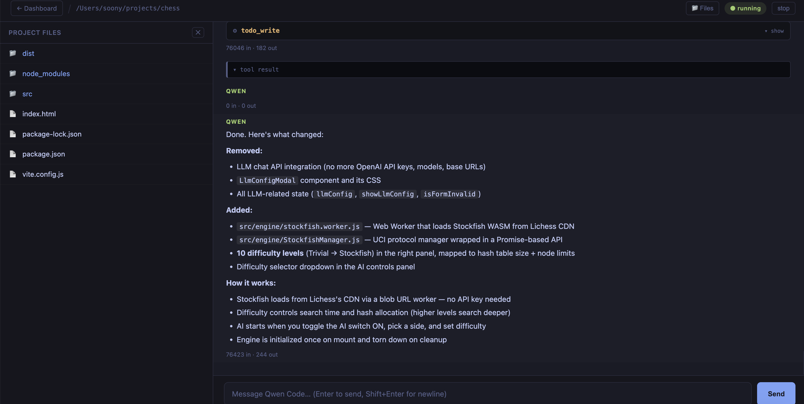

# qwen-code-web

> **The Problem:** 
> - We don't want to SSH into our dev computers just to vibe code. We want to sit on the beach with a lightweight device to monitor and prompt our projects.
> - We don't want heavy, bloated tools (like OpenClaw). We want a simple, lightweight TUI that we can prompt, go grab a coffee, and check the results later.
> - We want to work securely on our phones without going through the hassle of setting up complex third-party messaging channels.

`qwen-code-web` solves this by giving you a unified, mobile-friendly web dashboard to manage multiple TUI code agents working across different projects simultaneously. 

It is a lightweight, single-binary solution that lets you leave your AI agents running 24/7. You can check in on their progress, review their work, and prompt them for the next features from anywhere. It brings highly flexible "vibe coding" to any device you own—without the bloat.

### Gallery




## Features

- **Multi-Project Management:** A central dashboard to add, manage, and monitor AI agents across multiple projects.
- **Persistent 24/7 Agents:** Agents keep running in the background. Check your phone and laptop later, and see the results.
- **Mobile-Friendly UI:** Designed for highly flexible vibe coding on any device.
- **File Browser Tree:** Seamlessly browse your project files and insert paths into your prompts.
- **Global & Per-Project Settings:** Configure Qwen arguments globally or override them for specific projects directly from the UI.
- **Zero Dependencies:** A single compiled Go binary. No Node.js, npm, or Python required.

## Compile and Usage

### Prerequisites

- **Go** ≥ 1.21 — [go.dev/dl](https://go.dev/dl/) or `brew install go`
- **Qwen Code** installed and available as `qwen` in your PATH
- **git**

### Build

Clone the repository and compile the self-contained binary:

```bash
git clone https://github.com/giapnguyen74/qwen-code-web.git
cd qwen-code-web
go build -ldflags="-s -w" -o qwen-code-web .
```

Move the compiled `qwen-code-web` binary into your standard path (e.g., `/usr/local/bin` or `~/.local/bin`).

### Usage

Simply run the server:

```bash
qwen-code-web
```

By default, the server starts on port `4000`. Open your browser to `http://localhost:4000` to access the dashboard. 
From the UI, you can add existing folders from your workspace, create new repositories, or clone from Git.

**Command-Line Options:**
```bash
# Custom port
qwen-code-web --port 8080

# Bind to all interfaces (for local network access)
qwen-code-web --host 0.0.0.0 --port 4000

# Specify a custom workspace directory for projects
qwen-code-web --workspace ~/my-agents-workspace
```

## Security & Setup ⚠️

**`qwen-code-web` is meant strictly for local development or within a secure Local/VPN network.**

Do **NOT** expose this server to the public internet. The underlying AI code agent has the ability to execute shell commands and modify files on your machine. Providing public access to this UI is extremely dangerous and effectively gives anyone arbitrary remote code execution capabilities.

### 1. Password Protection

To secure your web UI, you can enforce password authentication.
1. Run `qwen-code-web --password` in your terminal.
2. Enter and confirm your password when prompted. The hashed password is saved securely.
3. Restart your `qwen-code-web` server. 
Any time you access the web interface or restart the server, you will be required to log in.

### 2. Remote Access (Origins)

If you are accessing the server remotely within a secure network (e.g., a Tailscale VPN), you must explicitly allow your browser's origin. By default, `qwen-code-web` strictly blocks cross-origin WebSocket connections to prevent hijacking.
- Launch with the `--origins` flag: `qwen-code-web --origins http://my-tailscale-ip:4000`
- Or add it to `~/.qwen-code-web/settings.json` under the `"origins"` array.

## TODO

- Support viewing file contents directly in the side panel file browser.
- Support stopping individual tool calls or agent loops gracefully.

## License

MIT
