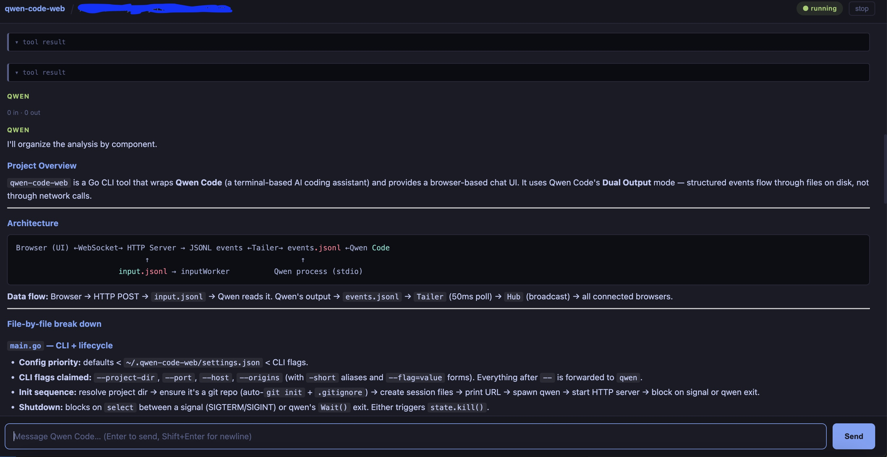

# qwen-code-web

A browser UI for [Qwen Code](https://github.com/QwenLM/qwen-code) TUI sessions.

Run one command, open a browser tab, and operate Qwen Code from a clean chat interface — streaming output, tool approval cards, session history — without touching the terminal again. Works in dual-output mode: the TUI stays live in your local terminal while the web UI streams the same session to any browser on the network.



## How it works

`qwen-code-web` spawns Qwen Code in your project folder using its [Dual Output](https://github.com/QwenLM/qwen-code/blob/main/docs/users/features/dual-output.md) mode (`--json-file` + `--input-file`). A local HTTP + WebSocket server tails the structured event stream and forwards it to the browser. The browser renders the conversation directly from events — no ANSI parsing, no terminal emulator.

The Qwen Code process and all session files stay on your machine. Nothing is sent anywhere else.

## Prerequisites

- **Go** ≥ 1.21 — [go.dev/dl](https://go.dev/dl/) or `brew install go`
- **Qwen Code** installed and available as `qwen` in your PATH
- **git**

No C compiler, no npm, no node-gyp. The Go binary is fully self-contained.

## Build and Install

To install `qwen-code-web`, clone the repository and compile the binary:

```bash
git clone https://github.com/giapnguyen74/qwen-code-web.git
cd qwen-code-web
go build -ldflags="-s -w" -o qwen-code-web .
```

Move the compiled `qwen-code-web` binary into your standard path (e.g. `/usr/local/bin` or `~/.local/bin`) to run it from anywhere.

## Usage

```bash
cd ~/my-project

# Start a fresh session
qwen-code-web

# Pass any qwen flags behind the -- separator
qwen-code-web -- -c          # continue qwen's own last conversation
qwen-code-web -- -y          # auto-approve all tool calls
qwen-code-web --port 4000 -- -y -c

# Custom port (default: 4000)
qwen-code-web --port 8080

# Bind to a specific interface only (default is 0.0.0.0 — all interfaces)
qwen-code-web --host 127.0.0.1

# Bind to all interfaces (for network/remote access)
qwen-code-web --host 0.0.0.0 --port 4000

# Explicit project directory (overrides cwd)
qwen-code-web --project-dir ~/other-project
```

`qwen-code-web` claims `--project-dir`, `--port`, `--host`, and `--origins`. Everything behind `--` is forwarded to `qwen` verbatim. Run `qwen --help` to see qwen's own flags.

The project folder is created (with `git init`) if it does not exist.

On launch, qwen's TUI renders in your terminal as normal (dual-output mode). The web UI at `http://<your-ip>:4000` streams the same session simultaneously — useful for remote access.

## Configuration File

You can set persistent configuration options by creating a `settings.json` file in `~/.qwen-code-web/settings.json`.

We provide a [settings.sample.json](file:///Users/lap16303-local/qwen-code-web/settings.sample.json) file in the root of the repository as a starting template.

Supported options:
- `host` (string): Listen address (e.g. `"0.0.0.0"` or `"127.0.0.1"`)
- `port` (number): HTTP server port (e.g. `4000`)
- `origins` (array of strings): Allowed WebSocket origins (e.g. `["http://your-remote-host:4000"]`). Must match the browser's address. Wildcards (`*`) are not supported for safety.
- `qwenArgs` (array of strings): Custom arguments to pass to the `qwen` executable automatically

Command-line flags will always take precedence over configurations in `settings.json`.

> [!IMPORTANT]
> **WebSocket Allowed Origins Security:**
> By default, `qwen-code-web` enforces strict same-origin verification (comparing the browser `Origin` and server `Host` headers) to protect your session.
> 
> Wildcards (`"*"`) are **not supported**. If you access this server remotely via a custom domain name or remote IP address, you **must** configure your specific host origin in the `origins` array (e.g. `["http://192.168.1.50:4000"]` or `["http://my-domain.local:4000"]`) to pass security validation. Local developer setups on `localhost` or `127.0.0.1` are always allowed automatically.

## Session files

Session data lives in `~/.qwen-code-web/`, outside your project — nothing is written into your working tree.

```
~/.qwen-code-web/
└── sessions/
    └── my-project_a1b2c3d4/   ← project name + 8-char path hash
        ├── events.jsonl        ← Qwen Code writes structured events here
        └── input.jsonl         ← server writes your messages and approvals here
```

Each project directory gets its own slot, keyed by its absolute path. Renaming or moving a project starts a new slot.

## Development

```bash
git clone https://github.com/giapnguyen74/qwen-code-web.git
cd qwen-code-web
go run . --project-dir ~/your-project
```

To build a release binary:

```bash
go build -ldflags="-s -w" -o qwen-code-web .
```

Cross-compile for other platforms:

```bash
GOOS=linux  GOARCH=amd64 go build -ldflags="-s -w" -o qwen-code-web-linux-amd64 .
GOOS=darwin GOARCH=arm64 go build -ldflags="-s -w" -o qwen-code-web-darwin-arm64 .
```

### Project layout

```
main.go        CLI entry point — flags, git init, spawn, server start
session.go     PTY spawn, session files, qwen binary resolution
tailer.go      Byte-offset JSONL file tailer (50 ms poll)
server.go      HTTP + WebSocket server, event replay, hub broadcast

public/
  index.html   Single-page browser UI — embedded into binary at build time
```

## Notes

**Input latency.** Qwen Code polls `input.jsonl` every 500 ms. After you hit Send there is up to half a second before Qwen sees the message. The UI shows a "sending…" indicator during this window.

**Stopping the session.** Click the **stop** button in the browser header, or press `Ctrl-C` in the terminal. Either way the Qwen Code process is killed cleanly.

## License

MIT
